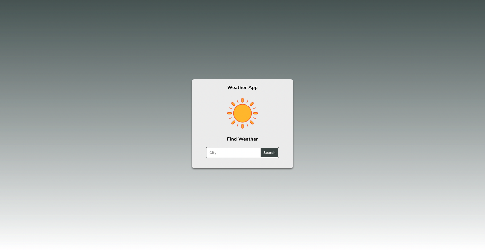
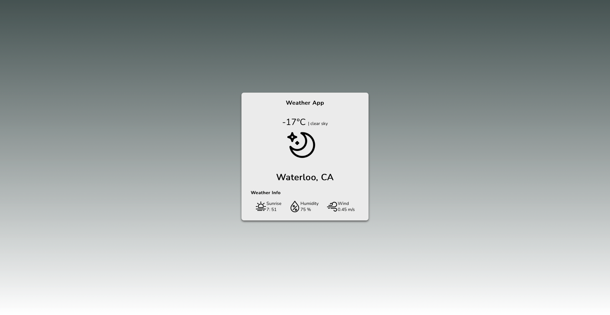

## Table of Contents
1. [General Info](#general-info)
2. [Technologies](#technologies)
3. [Installation](#installation)

# WeatherApp

WeatherApp is web application that uses React and javaScripts to allows user can find weather by city.

# Screenshots

Screenshot of searching city page.\

Screenshot of weather information page.\

# Technologies/FrameWork

* React 17.0.2
* JavaScript 16.13.1

# Features
* WeatherApp helps users to find important parts of weather information such as sunrise time, wind, and temperature easily.\

# Installation 

An intro of installation

$ git clone https://github.com/yeeunPark0630/WeatherApp
$ cd weather-app
$ npm install
$ npm start

# How to use?

1. Search city that you want to find weather in the search box below.
2. Step 1 leads you to move other page that shows the various weather informations of the city you searched.

# API References

Current Weather Data by OpenWeather 

# Icon References

sunrise icon from freeicons.io by www.wishforge.games   
wind icon from freeicons.io by www.wishforge.games   
humidity, night icons from flaticons.com by pixel perfect\
thunderstorm icons from freeicons.io by EDT.Graphics\
sunny, cloudy, cloudy-night, night, rain, rain2, snow icons from freeicons.io by oscar Estont\

